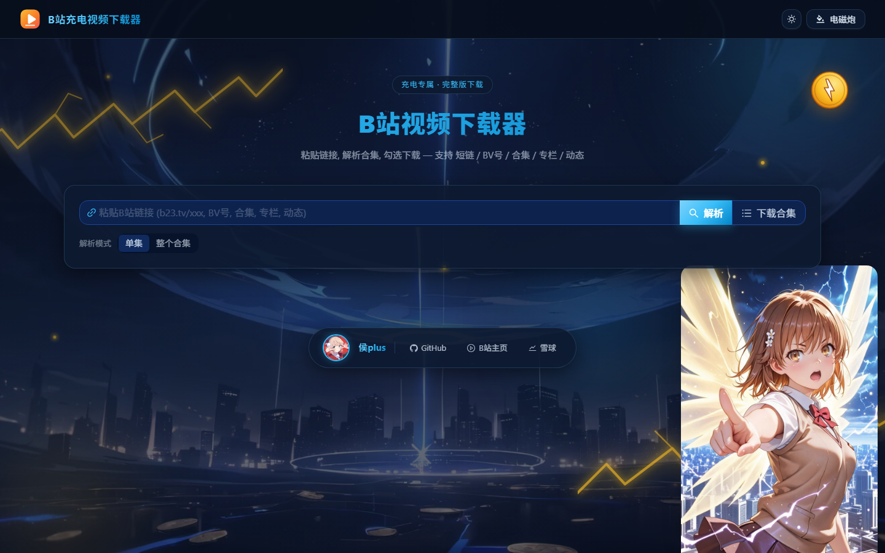
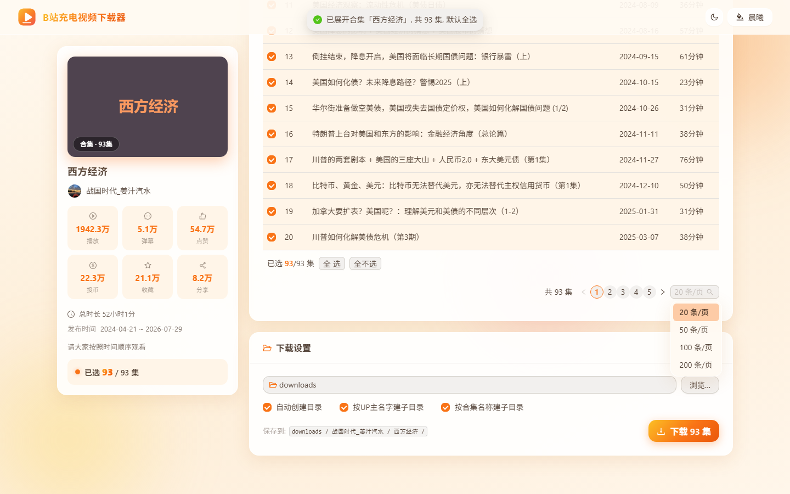
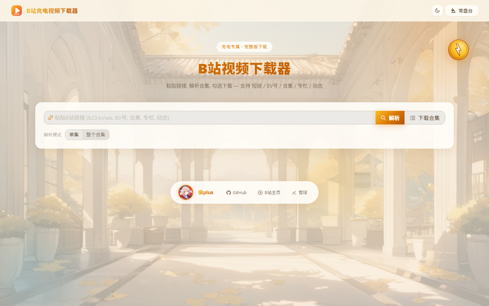

# B站充电视频下载器

下载B站**充电专属视频完整版**，支持 **UGC合集批量下载**，带高颜值 **Web前端**（扫码登录 + 选集下载 + 7套皮肤），提供 **Windows安装包 / Linux安装包 / Docker**（Unraid兼容）三种使用方式。

> 解决 [BBDown](https://github.com/nilaoda/BBDown) 1.6.3 登录失效问题：B站改版后 `BBDown login` 假成功（SESSDATA 永远为空），本工具直接调用B站扫码登录 API，从 `Set-Cookie` 响应头提取 cookie，再用 BBDown 下载充电视频完整版。



## 功能

- ✅ **充电视频完整下载**：扫码登录后下载充电专属视频完整版（非5分钟试看），1080P
- ✅ **UGC合集批量下载**：自动获取合集全部视频，表格复选（默认全选），单集/整合集两种解析模式
- ✅ **高颜值Web前端**：7套皮肤（晨曦/蜜桃/常盘台/暮色/熔岩/电磁炮/曜蓝），玻璃拟态，手机端自适应
- ✅ **目录设置**：可视化目录浏览器，按 `UP主/合集名` 自动建子目录（qBittorrent风格）
- ✅ **实时进度**：状态窗口显示封面/UP主/统计数据/下载进度
- ✅ **文件名带发布日期**：`视频标题_2026-07-29_20-16-56.mp4`
- ✅ **断点续传**：按 aid 记录已下载视频
- ✅ **应用内自动更新**：标题栏「更新」按钮检查新版本，Windows/Linux 免安装版可一键自动升级并重启



## 快速开始

### 方式一：Windows 安装包（推荐，开箱即用）

1. 到 [Releases](https://github.com/montrush/bilibili-charging-downloader/releases) 下载 `BiliDownloader-Setup-x.x.x.exe`
2. 安装后从开始菜单启动，启动窗口会提示选择端口（默认 8000，直接回车即可；被占用时会提醒换一个），随后自动打开浏览器
3. 无需安装 Python/Node/ffmpeg/BBDown，安装包已全部内置

> 也有免安装便携版 `BiliDownloader-portable-win-x64.zip`，解压即用。

### 方式二：Linux 安装包

```bash
# Debian / Ubuntu 系
sudo dpkg -i bili-downloader_x.x.x_amd64.deb
bili-downloader        # 启动时会提示选端口(默认8000回车即可), 然后访问 http://127.0.0.1:8000
```

其他发行版下载 `bili-downloader-linux-x64.tar.gz` 解压运行，或用下面的 Docker。

### 方式三：Docker（NAS / 服务器）

```bash
docker run -d \
  --name bili-downloader \
  -p 8000:8000 \
  -v $(pwd)/config:/config \
  -v $(pwd)/downloads:/downloads \
  --restart unless-stopped \
  ghcr.io/montrush/bilibili-charging-downloader:latest
```

启动后访问 `http://localhost:8000`。也支持 `docker compose up -d`。

### 方式四：Unraid 部署

1. Unraid -> Apps -> 搜索 `bilibili-charging-downloader`（或手动添加模板）
2. 设置 WebUI端口、配置目录(`/mnt/user/appdata/bili-downloader`)、下载目录
3. 安装后访问 `http://<Unraid-IP>:8000`

> 模板文件：`unraid/bilibili-charging-downloader.xml`

## 使用说明

1. **扫码登录**：打开 WebUI，用手机B站APP扫描页面二维码并确认登录
   - ⚠️ 必须用**已充电的B站账号**，否则充电视频仍只能下试看
2. **粘贴链接**：支持 `b23.tv/xxx` 短链、BV号、合集链接、专栏、动态
3. **解析模式**：输入框下方开关 —「单集」只下当前集，「整个合集」展开全合集
4. **选集**：复选框选择（默认全选），分页大小 20/50/100/200 可调
5. **下载**：设置下载路径（默认 `下载目录/UP主/合集名/`），实时查看进度



## 环境变量（进阶）

| 变量 | 默认 | 说明 |
|---|---|---|
| `BILI_PORT` | `8000` | Web服务端口 |
| `BILI_CONFIG_DIR` | 各平台配置目录 | cookie/登录态存放位置 |
| `BILI_DOWNLOAD_DIR` | 项目下 `downloads` | 默认下载目录 |

## 工作原理

### 登录（解决BBDown bug）

```
B站扫码登录 poll API 返回 code=0 时:
  data.url  -> 只含 ticket (BBDown 1.6.3 从这里解析, 永远空)
  Set-Cookie -> 含 SESSDATA等cookie (本工具从这里提取)
```

本工具用 Python `requests` 的 `r.cookies`（自动解析 Set-Cookie 响应头）提取 cookie，这是 BBDown 1.6.3 没跟上的地方。

### 合集下载

BBDown 1.6.3 不认合集 URL，本工具用 B站 API `ugc_season` 获取全部 aid + pubdate，逐个调用 BBDown 下载。

## 项目结构

```
├── server/                 # FastAPI后端
│   ├── main.py            # API应用(静态托管前端dist)
│   ├── routers/           # login/parse/download/fs路由
│   ├── services/          # bili_auth(登录) + bili_dl(解析下载)
│   └── task_manager.py    # 下载任务管理(后台线程+进度)
├── web/                    # React前端(Ant Design 5 + Vite)
│   ├── src/theme/skins.ts # 7套皮肤注册表
│   └── src/pages/         # LoginPage + DownloadPage
├── packaging/              # 安装包打包(PyInstaller spec/Inno Setup/deb)
├── Dockerfile             # Linux Docker(Unraid兼容)
├── docker-compose.yml
├── run_windows.bat        # Windows原生运行(开发用)
├── unraid/                # Unraid部署模板
├── .github/workflows/     # CI: Docker镜像(GHCR) + Release安装包
├── bili_login.py          # 命令行版登录(独立使用)
└── bili_download.py       # 命令行版下载(独立使用)
```

## 开发模式

```bash
# 后端
pip install -r server/requirements.txt
python -m uvicorn server.main:app --port 8000 --reload

# 前端(另一个终端)
cd web
npm install
npm run dev    # http://localhost:5173 (代理到8000)
```

## 常见问题

**Q: 下载的充电视频只有5分钟？**
A: cookie没生效。检查：1)是否扫码登录成功；2)登录的账号是否已给UP主充电；3)cookie是否过期（重新扫码）。

**Q: Docker里下载的视频在哪？**
A: 在挂载的 `/downloads` 目录（docker-compose.yml 里映射到 `./downloads`）。

**Q: 端口8000被占用？**
A: Windows/Linux 安装版启动时会先让你选端口，8000 被占用会直接提醒，输入别的端口（如 8001）回车即可。也可以提前设环境变量 `BILI_PORT=8001` 跳过询问。Docker 则改端口映射 `-p 8001:8000`。

**Q: 合集只下了1集？**
A: 不会，本工具自动获取合集全部视频。粘贴单集链接默认「单集」模式，点「整个合集」展开。

## 致谢

- [BBDown](https://github.com/nilaoda/BBDown) - B站下载引擎 (MIT)
- [ffmpeg](https://ffmpeg.org) - 音视频合成 (LGPL/GPL)
- [Ant Design](https://ant.design) - 前端UI组件
- 皮肤美术素材为 Stable Diffusion 生成及作者自绘

## License

MIT（第三方组件许可见 [THIRD_PARTY_NOTICES.md](THIRD_PARTY_NOTICES.md)）
